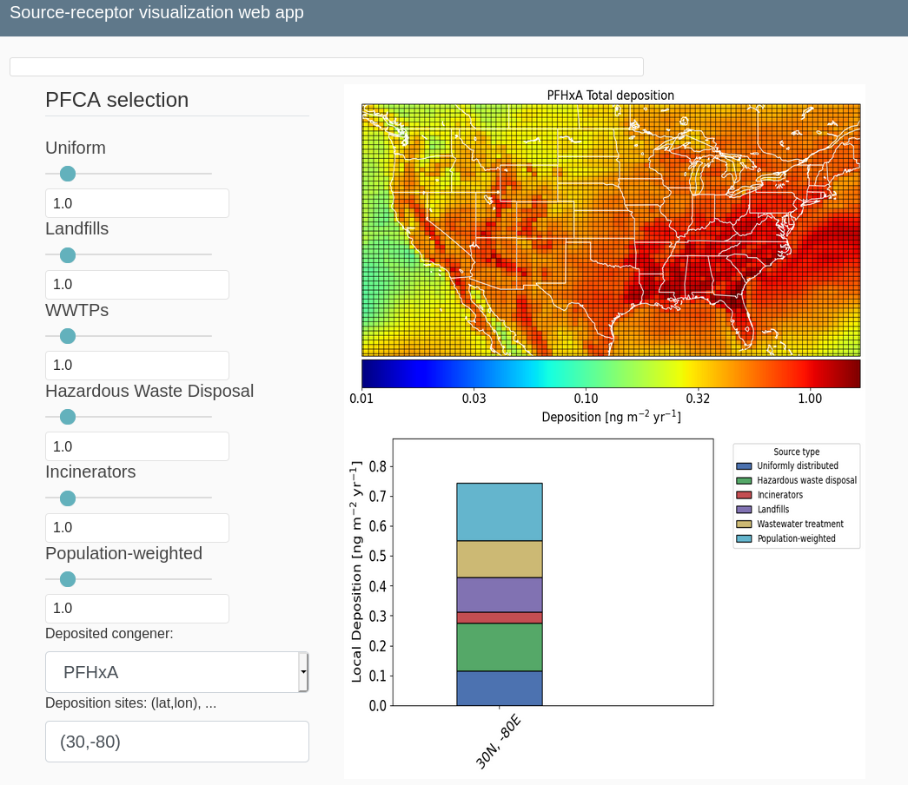

# source-receptor-vis

Interactive source-receptor relationship visualization for atmospheric PFAS.



# Prerequisites
 - Flask
 - WTForms
 - cartopy
 - numpy
 - matplotlib
 - xarray


# Post-installation setup

1. Download data (TBA)
2. In a file called myconfig.py, save the following definitions:
 ```python
 SECRET_KEY = "PUT YOUR SECRET STRING HERE"
 DATAPATH = "PATH/TO/THE/DOWNLOADED/DATA/"
 ```
